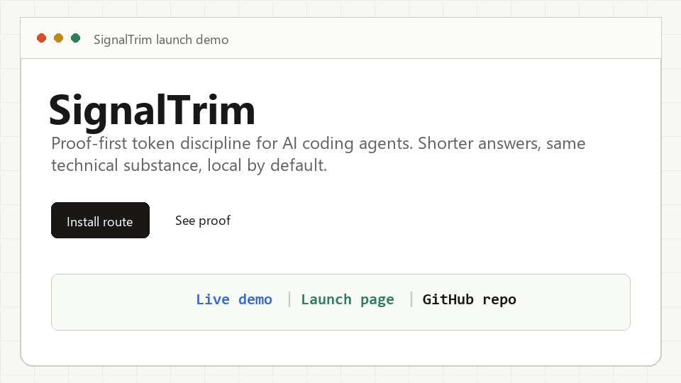

<p align="center">
  
</p>

<p align="center">
  <strong>Proof-first token discipline for AI coding agents.</strong>
</p>

<p align="center">
  Install once across Claude Code, Codex, Gemini, Cursor, Windsurf, opencode, and 30+ more agents.
  SignalTrim removes filler from agent replies while preserving code, commands, errors, and technical meaning.
</p>

<p align="center">
  <a href="https://signaltrim.pages.dev/#proof">Live demo</a> |
  <a href="https://signaltrim.pages.dev/">Launch page</a> |
  <a href="https://github.com/karurikwao/signaltrim">GitHub repo</a> |
  <a href="docs/wiki/Home.md">Wiki</a>
</p>

<p align="center">
  
</p>

<p align="center">
  <a href="https://github.com/karurikwao/signaltrim/stargazers"></a>
  <a href="./INSTALL.md"></a>
  <a href="./docs/HONEST-NUMBERS.md"></a>
  <a href="LICENSE"></a>
</p>

<p align="center">
  <a href="#before--after">Before/After</a> ·
  <a href="#install">Install</a> ·
  <a href="#modes">Modes</a> ·
  <a href="#what-ships">What ships</a> ·
  <a href="#proof">Proof</a> ·
  <a href="#privacy">Privacy</a> ·
  <a href="docs/wiki/Home.md">Wiki</a>
</p>

---

SignalTrim is a local skill, hook system, installer, compression tool, and MCP proxy for making AI coding agents answer with less ceremony. The core claim is deliberately narrow: **shorter output, same technical substance, measured honestly**.

It does not pretend input tokens vanish. It does not hide rule overhead. It does not route your work through a hosted backend. It gives you compact replies, local stats, safer memory compression, and install paths that fit the agent you already use.

## Before / After

<table>
<tr>
<th width="50%">Normal agent</th>
<th width="50%"> SignalTrim</th>
</tr>
<tr>
<td valign="top">

> The reason your React component is re-rendering is likely because you're creating a new object reference on each render cycle. When you pass an inline object as a prop, React's shallow comparison sees it as a different object every time, which triggers a re-render. I'd recommend using useMemo to memoize the object.

</td>
<td valign="top">

> New object ref each render. Inline object prop = new ref = re-render. Wrap in `useMemo`.

</td>
</tr>
<tr>
<td valign="top">

> Sure! I'd be happy to help you with that. The issue you're experiencing is most likely caused by your authentication middleware not properly validating the token expiry. Let me take a look and suggest a fix.

</td>
<td valign="top">

> Bug in auth middleware. Token expiry check uses `<` instead of `<=`. Fix:

</td>
</tr>
</table>

Same fix. Less filler. Code, paths, CLI commands, and exact error strings stay untouched.

```
output tokens saved   █████████       65%
input tokens saved    ░░░░░░░░░         0%
technical substance   █████████      kept
telemetry             ░░░░░░░░░       none
```

## Install

**One command. Detects supported agents and installs the best known path for each.**

```bash
# macOS, Linux, WSL, Git Bash
curl -fsSL https://raw.githubusercontent.com/karurikwao/signaltrim/main/install.sh | bash
```

```powershell
# Windows PowerShell 5.1+
irm https://raw.githubusercontent.com/karurikwao/signaltrim/main/install.ps1 | iex
```

Needs Node 18+. Safe to re-run. Use `--dry-run` when you want to preview the writes first.

> [!TIP]
> Activate with `/signaltrim` or "use SignalTrim mode". Deactivate with "normal mode". Claude Code plugin installs can auto-activate at session start; static skill/rule installs may need the first command.

<details>
<summary><strong>Install for one agent</strong></summary>

```bash
# Claude Code plugin
claude plugin marketplace add karurikwao/signaltrim && claude plugin install signaltrim@signaltrim

# Gemini CLI extension
gemini extensions install https://github.com/karurikwao/signaltrim

# Codex / Cursor / Windsurf / Cline / Copilot / long tail
npx skills add karurikwao/signaltrim -a codex

# opencode native integration
npx -y github:karurikwao/signaltrim -- --only opencode
```

The full per-agent matrix, flags, dry-run mode, and uninstall path live in [INSTALL.md](./INSTALL.md).
For the full repo guide, see the [SignalTrim wiki](./docs/wiki/Home.md).

</details>

## Modes

Switch anytime with `/signaltrim <mode>`.

| Mode | Shape |
|---|---|
| `lite` | Full sentences, no filler or hedging. |
| `full` | Default. Fragments allowed, articles dropped where clear. |
| `ultra` | Maximum terseness without invented abbreviations. |
| `wenyan-lite` | Classical Chinese register, lighter compression. |
| `wenyan-full` | Classical Chinese compression, balanced. |
| `wenyan-ultra` | Maximum classical compression. |

SignalTrim preserves the user's language. Portuguese stays Portuguese, Spanish stays Spanish, French stays French. The style compresses; the language does not silently change.

## What Ships

| Command or module | What it does |
|---|---|
| `/signaltrim [mode]` | Compact every reply until changed or disabled. |
| `/signaltrim-commit` | Conventional Commit messages with short, useful subjects. |
| `/signaltrim-review` | Dense PR findings in a line-focused format. |
| `/signaltrim-stats` | Reads local Claude Code session logs and estimates output savings. |
| `/signaltrim-compress <file>` | Rewrites natural-language memory files after backup and validation. |
| `signaltrim-shrink` | MCP stdio proxy that compresses tool descriptions before the model reads them. |
| `signalteam-*` | Compact subagents for investigation, building, and review. |

Claude Code statusline support shows `[SIGNALTRIM]` and, after `/signaltrim-stats`, an optional compact savings suffix such as `saved 12.4k`.

## Proof

Committed benchmark data shows **65% average output-token reduction** across 10 prompts, measured against default verbose replies. Results are reproducible from [`benchmarks/`](./benchmarks/) and [`evals/`](./evals/).

<!-- BENCHMARK-TABLE-START -->
| Task | Normal | SignalTrim | Saved |
|------|-------:|--------:|------:|
| Explain React re-render bug | 1180 | 159 | 87% |
| Fix auth middleware token expiry | 704 | 121 | 83% |
| Set up PostgreSQL connection pool | 2347 | 380 | 84% |
| Explain git rebase vs merge | 702 | 292 | 58% |
| Refactor callback to async/await | 387 | 301 | 22% |
| Architecture: microservices vs monolith | 446 | 310 | 30% |
| Review PR for security issues | 678 | 398 | 41% |
| Docker multi-stage build | 1042 | 290 | 72% |
| Debug PostgreSQL race condition | 1200 | 232 | 81% |
| Implement React error boundary | 3454 | 456 | 87% |
| **Average** | **1214** | **294** | **65%** |
<!-- BENCHMARK-TABLE-END -->

> [!IMPORTANT]
> SignalTrim shrinks output tokens. Input tokens, reasoning tokens, and the rule text itself still exist. On already-terse work, whole-session cost can go net-negative. The honest breakdown is in [docs/HONEST-NUMBERS.md](./docs/HONEST-NUMBERS.md).

`/signaltrim-compress` is a separate input-token tool for memory files. Current fixtures average **46% smaller** while preserving headings, code blocks, URLs, paths, commands, and structure.

## What Makes It Different

SignalTrim is designed as a complete product surface, not a single prompt:

- Native-ish install paths for many agents instead of one generic instruction blob.
- Claude Code hooks for automatic activation, mode tracking, and statusline feedback.
- Verified memory compression with backups, validation, retries, and atomic replace.
- MCP description shrinker for tool-heavy workflows.
- Local stats that show estimates without pretending every workflow saves money.
- A static demo site in `docs/` that can be hosted directly on Cloudflare Pages.

No duplicated feature families, no fake sibling repos, no hidden hosted dependency.

## How It Works

1. Installer drops SignalTrim skills, hooks, commands, or rule files into the agent-specific location.
2. The skill tells the agent to remove filler while preserving technical artifacts exactly.
3. Claude Code hooks track the active mode in `$CLAUDE_CONFIG_DIR/.signaltrim-active`.
4. `/signaltrim-stats` reads the active session log and writes local history.
5. `/signaltrim-compress` rewrites selected memory files only after validation passes.

Maintainer details are in [CLAUDE.md](./CLAUDE.md).

## Privacy

Core SignalTrim has no backend, account, analytics, or background telemetry. Skills and hooks are local files. Stats read logs already on your disk.

Optional operations can still call networks you explicitly invoke:

- Installer fetches from GitHub and the target agent registries.
- `npx skills add`, `gemini extensions install`, and plugin installers use their own registries.
- `/signaltrim-compress` sends the file you name through the model provider used by your agent.
- `signaltrim-shrink` can wrap upstream MCP servers that make their own calls.

See [SECURITY.md](./SECURITY.md#privacy--telemetry) for the full statement.

## Star This Repo

SignalTrim earns stars by being useful on day one: install works, docs are honest, output is tighter, and the demo proves the shape. Star it if you want coding agents to spend fewer words on the same work.

---

<sub>
<strong>Docs:</strong>
<a href="./INSTALL.md">Install matrix</a> ·
<a href="./docs/wiki/Home.md">Wiki</a> ·
<a href="./docs/HONEST-NUMBERS.md">Honest numbers</a> ·
<a href="./CONTRIBUTING.md">Contributing</a> ·
<a href="./CLAUDE.md">Maintainer guide</a> ·
<a href="https://github.com/karurikwao/signaltrim/issues">Issues</a>
<br><br>
MIT.
</sub>
